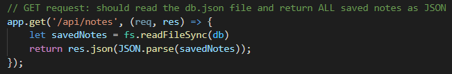

# memory-help-pls

## Deployed Webpage 

[Link to webpage](https://memory-help-pls.herokuapp.com/)

## Description  

The goal of this project is to build a note-taking app. The note-taking app is opened when the user clicks the link on the landing page. From there, the user is presented with previously-written notes on the left-hand column, with the right side containing empty fields for a new note. The note can be saved only when the title and text are both entered. The note can be accessed again to view the note, and can also be deleted. New notes can be added at any time. The front end of this project is provided, so the main objective is to build the entire back-end of the project.

 JavaScript is used to build the back-end of this project. More specifically, the Express.js framework within Node.js is key for this project. The `app.get, app.post, and app.delete` are used to build the api and html routes that help make this a functional webpage. Calling upon the different dependencies within each file allows

## Technologies Used 
* JavaScript
    * Node.js
    * Express.js

## Usage

To use this application, visit the deployed link. Click the "Get Started" button to start taking notes. Click the save button after writing both the note title and text. Check your saved notes in the left-hand column. Click the "+" button to add a new note. Click the trash can icon to delete a note. 

## Installation

1. Create a new repository on Github. 
    - Press the "+" sign on the top right hand corner, or the "new" button on your GitHub homepage. 
    - Create an unique name for your repository, and make the respository public. 
    - Click the "README" option to include the "README" page. 
    - Your new repository has been created.
2. Open GitBash (PC users) or Terminal (Mac users).
    - Navigate to where you want to clone your new repository onto your local machine. 
        - Use `cd` to help you navigate. 
3. To clone the new repository onto your local machine. 
    - Click the respository that you just made on github.com.
    - Click the "code" button and choose the SSH option. 
    - Copy the SSH option to your clipboard. 
    - On GitBash/Terminal, enter the command `git clone git@github.com:<UserNAME>/<demo-repo>.git`
        - After `git clone`, paste the SSH option from your clipboard into GitBash/Terminal.
        - Since the SSH option was used, enter the password for the SSH key when asked. 
4. You have now cloned your new repository.
    - Using `cd`, navigate into your new repository from the location that you have saved it in. 
    - Use `ls` to see what is inside the new repository currently. 
        - It should only include the README page as of now.
5. Tranferring the project files into your new directory on your local machine. 
    - Using Finder/Explorer, copy the corresponding files that are needed to edit your project. 
    - In another Finder/Explorer window, navigate to your new repository, and paste the files directly into that folder. 
6. On GitBash/Terminal, after pasting the project files into the new repository. 
    - Use `ls` to see what is now inside the new repository.
        - This should now include the README page, and the project files that you have copy-pasted in. 
7. Use `git status` to see if there any changes that need to be made to the repository. 
    - At this point, git will tell you that there is an untracked file .
8. Use `git add .` to add the new project files, and allow the new files to be tracked by git.
9. Use `git commit -m "add base project files"` to commit the changes have recently been made to the repository. 
10. Use `git push origin main` to sync your local machine with GitHub. 
    - Enter your SSH password when prompted. 
11. Use `code .` to open the files on a code reader of your choice.
12. Edit the files as necessary in your code reader. 
13. Periodically, and when you are finished with editing your code: 
    - Follow Steps 7-10 to keep your repository up to date with the changes that have been made. 
14. How to deploy the webpage:
    - After one final push to the repository, direct yourself to the repository's settings. 
    - Click the "pages" option from the sidebar. 
    - Select "main branch" as the source, and check that it selected for the "root" option. 
    - Click "Save" to deploy your webpage. 
    - *Give 5-10 minutes for the webpage to display the full contents.
15. You have successfully completed this project!

## Credits

Initial prompt and front-end code given by UC Berkeley Extension, Coding Bootcamp. 

## Reflection

For this project, it was important to learn the usage of Express within JavaScript in order to retreive data from the API. The use of `app.get, app.post, and app.delete` is integral to calling upon the `db.json` file which is storing the user's notes. I ran into a little bit of trouble with the post function and delete function, but everything works great!

## License

Licensed under the [MIT](https://choosealicense.com/licenses/mit/#) license. 

## Contributors

Feel free to reach out to me at the following: 
* [LinkedIn](https://www.linkedin.com/in/snehita-kolli-0abb23b1/)
* [GitHub](https://github.com/snehitak20)
